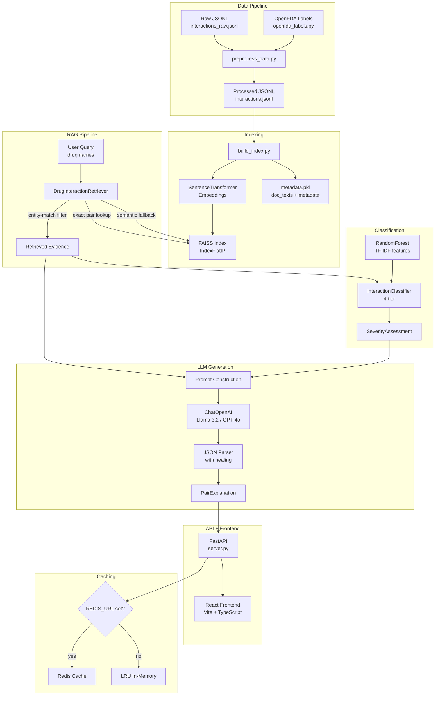

# Architecture — Drug Interaction AI

> End-to-end Retrieval-Augmented Generation (RAG) system for clinical drug-drug interaction analysis.

---

## System Overview



---

## Module Reference

### Data Pipeline (`data_pipeline/`)

| File | Purpose |
|------|---------|
| `fetch_drug_data.py` | Seeds the initial curated interaction dataset via RxNorm API lookups |
| `openfda_labels.py` | Pulls and parses FDA drug label sections (drug interactions, warnings) |
| `preprocess_data.py` | Normalises drug names, deduplicates pairs, builds embeddable document text |

**Key functions in `preprocess_data.py`:**
- `normalise_drug_name()` — lowercases, strips dosage info, resolves synonyms (e.g. `Advil → ibuprofen`)
- `build_document_text()` — combines mechanism, clinical effects, management, and raw context into a single embedding-ready string
- `is_valid_record()` — quality filter ensuring both drug names and interaction content exist
- `process_records()` — full pipeline: normalise → deduplicate → filter → build docs

### Embedding & Indexing

| File | Purpose |
|------|---------|
| `rag_pipeline/embeddings.py` | Wraps `SentenceTransformer` with persistent disk cache (`data/embedding_cache/`) |
| `build_index.py` | Orchestrates: load processed JSONL → chunk documents → embed → build FAISS → save |

**Embedding model:** `sentence-transformers/all-MiniLM-L6-v2` (384-d, unit-normalised for cosine similarity via inner product)

### Vector Store (`rag_pipeline/vector_store.py`)

`DrugVectorStore` manages a FAISS index with parallel `doc_texts[]` and `metadata[]` lists.

| Feature | Method | Description |
|---------|--------|-------------|
| Exact pair lookup | `exact_pair_lookup()` | O(1) via `_pair_index: frozenset({a, b}) → [int]` |
| Semantic search | `search()` | k-NN with cosine threshold filtering |
| MMR search | `mmr_search()` | Maximal Marginal Relevance to reduce duplicate docs |
| Filtered search | `filter_search()` | Post-retrieval severity filter |
| Incremental add | `add_documents()` | Add new docs without full rebuild |
| Persistence | `save()` / `load()` | FAISS binary + pickle metadata |

**Index types:** `IndexFlatIP` (exact, default), `IndexIVFFlat` (approximate, for >500k docs).

### Retriever (`rag_pipeline/retriever.py`)

`DrugInteractionRetriever.retrieve()` implements a two-step strategy:

1. **Exact pair lookup** — O(1) hash lookup for known drug pairs. Returns all stored documents with similarity=1.0.
2. **Semantic fallback** — if no exact match, embeds the query `"drug_a drug_b interaction"` and runs cosine search. Results are **entity-filtered**: documents that do not literally mention both queried drug names are rejected to prevent hallucination.

Output: `RetrievedEvidence` dataclass containing `documents`, `top_text`, `top_score`, `top_metadata`.

### Classification (`models/`)

| File | Purpose |
|------|---------|
| `interaction_classifier.py` | 4-tier severity classification (see Confidence Score section below) |
| `severity_classifier.py` | RandomForest + TF-IDF ensemble with drug-class features |

### Agent Pipeline (`chatbot/interaction_agent.py`)

`DrugInteractionAgent.analyze()` runs a **6-stage pipeline**:

| Stage | Method | Description |
|-------|--------|-------------|
| 1 | `_stage1_combinations()` | Generates all unique drug pairs from input list |
| 2 | `_stage2_retrieval()` | Retrieves evidence for each pair via the retriever |
| 3 | `_stage3_classification()` | Classifies severity using the 4-tier classifier |
| 4 | `_stage4_explanation()` | Calls LLM with evidence + severity context, parses JSON response |
| 5 | `_stage5_synthesis()` | Computes overall risk, deduplicates monitoring priorities |
| 6 | `_stage6_report()` | Assembles final `InteractionReport` object |

**Key dataclasses:**
- `DrugCombination` — a pair with `pair_key` (e.g. `"aspirin+warfarin"`)
- `RetrievedEvidence` — documents, scores, and metadata from retrieval
- `SeverityAssessment` — dual-classifier result with consensus logic
- `PairExplanation` — LLM-generated explanation with citation fields
- `InteractionReport` — final output with `to_dict()` serialisation
- `ReasoningTrace` — step-by-step log of every agent decision

### Caching (`cache.py`)

| Class | Backend | Cache Key |
|-------|---------|-----------|
| `RedisInteractionCache` | Redis (if `REDIS_URL` set) | `ddi:v1:{sorted_pair}:{model}:{index_hash}` |
| `LRUInteractionCache` | In-memory `functools.lru_cache` | Same key structure |

Both cache retrieval evidence + final structured result. Deterministic key = sorted drug pair + model version + index version.

### API (`api/server.py`)

| Endpoint | Method | Description |
|----------|--------|-------------|
| `/analyze_interaction` | POST | Main analysis endpoint. Accepts `{"drugs": [...]}` |
| `/api/v1/drugs/search` | GET | RxNorm-powered drug name autocomplete |
| `/api/v1/health` | GET | Health check with vector store stats |
| `/api/v1/stats` | GET | System statistics |

**Pydantic models:** `AnalyzeRequest`, `DrugInteraction` (with citation fields), `AnalyzeResponse`

### Frontend (`frontend/`)

React + TypeScript + Vite single-page application.

| Component | Purpose |
|-----------|---------|
| `App.tsx` | Root layout, state management, error handling |
| `DrugSearch.tsx` | Autocomplete search with RxNorm API |
| `SelectedDrugs.tsx` | Drug chip display with remove functionality |
| `AnalyzeButton.tsx` | Submit button with loading state |
| `ResultsPanel.tsx` | Expandable interaction cards with severity badges, citation links |

### Configuration (`config.py`)

Uses `pydantic-settings` with `.env` file support. Key settings:

| Setting | Default | Description |
|---------|---------|-------------|
| `llm_model` | `gpt-4o-mini` | LLM model name |
| `llm_max_tokens` | `4096` | Max generation tokens (prevents truncation) |
| `llm_temperature` | `0.1` | Low temp for clinical accuracy |
| `embedding_model` | `all-MiniLM-L6-v2` | Sentence transformer model |
| `rag_top_k` | `5` | Number of documents to retrieve |
| `similarity_threshold` | `0.55` | Minimum cosine similarity |
| `redis_url` | `None` | Optional Redis URL for caching |

---

## Confidence Score Calculation

The severity confidence score is computed by a **4-tier classification system** with dual-classifier consensus.

### Tier 1 — Structured Metadata (Highest Priority)

If the retrieved document's metadata contains a `severity` value from a trusted source (`rxnorm`, `curated`, `fda`, `drugbank`):

```
confidence = 0.95 (fixed)
method = "structured"
```

### Tier 2 — Keyword Matching

Scans the full interaction text for clinical signal words. Three keyword sets (Severe, Moderate, Low) are checked in priority order:

```
Severe:   confidence = min(0.95, 0.70 + 0.05 × keyword_count)
Moderate: confidence = min(0.90, 0.60 + 0.05 × keyword_count)
Low:      confidence = min(0.85, 0.60 + 0.05 × keyword_count)
```

Examples of severe keywords: `contraindicated`, `fatal`, `serotonin syndrome`, `rhabdomyolysis`, `qt prolongation`

### Tier 3 — ML Random Forest

When Tiers 1–2 yield Unknown or low confidence (<0.65), the Random Forest model is invoked:

```
confidence = max(class_probabilities)
method = "ml_random_forest"
```

Features: TF-IDF vectors of the interaction text + drug class categories. Trained on the curated dataset via `severity_classifier.py`.

### Tier 4 — Unknown Fallback

```
confidence = 0.0
method = "default"
```

### Dual-Classifier Consensus

When both keyword and ML classifiers produce results, reconciliation uses:

| Condition | Result |
|-----------|--------|
| Structured match exists | Use Tier 1 (conf 0.95) |
| Both agree on severity | Use agreed severity, conf = `max(kw, ml) + 0.05` boost |
| Only keyword ≥ 0.65 | Use keyword result |
| Only ML ≥ 0.65 | Use ML result |
| Disagreement, both ≥ 0.65 | Use higher confidence with 0.05 penalty |
| Both < 0.65 | Use "Unknown" with conf 0.0 |

---

## Data Storage

| Location | Format | Contents |
|----------|--------|----------|
| `data/raw/interactions_raw.jsonl` | JSONL | 15 curated drug interaction records with source URLs |
| `data/processed/interactions.jsonl` | JSONL | Preprocessed, embeddable documents with metadata |
| `data/vectorstore/drug_interactions.faiss` | FAISS binary | Inner-product index over 384-d embeddings |
| `data/vectorstore/metadata.pkl` | Pickle | Parallel `doc_texts[]` and `metadata[]` lists |
| `data/embedding_cache/embeddings.pkl` | Pickle | Cached embeddings to avoid re-computation |
| `models/saved/rf_severity_classifier.pkl` | Pickle | Trained RandomForest severity classifier |
