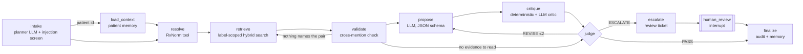

# Clinical evidence agent (LangGraph)

A stateful agent that reviews medication combinations against FDA label text and decides, under an explicit
policy, whether it may release a grounded summary on its own or must hand the case to a pharmacist.
Everything runs locally: Llama 3.2 (3B) through Ollama, hybrid retrieval on CPU, SQLite for checkpoints,
memory and the audit log. It is research decision support, not a clinical system.



## State
`AgentState` (agent/graph.py) carries the case through the graph: extracted medications, existing
medications from memory, RxNorm resolutions, unresolved names, pairs to check, label evidence per pair,
retrieval gaps, the proposal, the critic report, critic feedback, revision count, verdict, escalation
reasons, the review ticket, the pharmacist's decision, and an append-only trace of every node and tool
call (arguments, attempts, latency, errors). The graph is compiled with a checkpointer (`thread_id` =
case id): SQLite in the API, so an escalated case survives a restart and resumes where it stopped.

## Nodes
| Node | What it does | Model? |
|---|---|---|
| intake | Extracts medication mentions (planner LLM, schema-constrained); drops names not grounded in the request text; flags prompt-injection patterns; finds a patient id | yes (planner) |
| load_context | Reads the patient's current medications and recent reviews from long-term memory | no |
| resolve | RxNorm resolution: exact ingredient, brand map, spelling correction against common drugs (≥0.8), long-tail matches only at ≥0.9 and flagged as low confidence | no |
| retrieve | Hybrid BM25 + dense + RRF + cross-encoder search, restricted to the two drugs' labels (metadata filter) | no |
| validate | Keeps passages that name the partner drug or its pharmacologic class; if none, retries once with class-aware query rewriting; then records `none_documented` or `insufficient_evidence` | no |
| propose | Writes one finding per pair (severity, summary, citations) from compressed evidence | yes (proposer) |
| critique | Deterministic checks plus an LLM critic (see below) | yes (critic) |
| judge | PASS / REVISE / ESCALATE under the policy | no |
| escalate → human_review | Opens an idempotent review ticket, then `interrupt()`s until a pharmacist approves, overrides or rejects | no |
| finalize | Structured result with citations, hash-chained audit entry, memory update (only after release or approval) | no |

## Proposer → critic → judge
The critic has two layers. Deterministic checks are hard failures: every pair with evidence gets exactly
one finding; every citation is a passage retrieved for that pair; risk concepts in a summary (bleeding,
serotonin syndrome, QT prolongation, rhabdomyolysis, ...) must appear in the cited passages; no
"safe to take together"-style claims; and label language about serious harm sets a severity floor of
*high*. The LLM critic adds soft issues (unsupported claim, severity too low), which can trigger at most
one revision. The judge sends hard issues back to the proposer with the critic's feedback (at most two
revisions) and escalates if they survive.

**Policy change after the first run (v1 → v2).** v1 set the severity floor only on contraindication
language ("contraindicated", "avoid concomitant use", "life-threatening"). In the first run Llama 3.2
rated several curated Severe pairs as moderate when the label warned of serious bleeding without saying
"contraindicated" (warfarin + ibuprofen, fluconazole + warfarin), and one duplicate finding invented
"serotonin syndrome" for lithium + ibuprofen. v2 extends the floor to serious-harm language, rejects
duplicate findings, and adds the risk-concept grounding check. Both floors are in the code
(`AgentConfig.severity_floor`) and both are reported below.

## Escalation policy (agent/policy.py)
The agent may, on its own, resolve medication identities, retrieve and quote label evidence, and release
a cited summary. It must escalate when a finding is high severity, a medication cannot be identified, a
drug has no label in the corpus, a tool stays down after retries, the request contains an injection
attempt, fewer than two medications are known, the model is unavailable, or critic issues survive the
revision budget. Patient memory is only written after release or pharmacist approval.

## Memory and context engineering
`PatientMemory` (SQLite) keeps each patient's medication list and recent reviews, so "P-201 started
ibuprofen" is checked against warfarin and metformin already on file. `ContextBuilder` assembles the
prompt under a token budget: only sentences that name the partner drug or its class, or carry risk
language, ranked and cut at the budget, each tagged with its passage id so citations can be verified.

## Tools and MCP
`ToolRegistry` wraps five tools with argument validation, retries with exponential backoff, fault
injection for tests, and a trajectory record per call. `agent/mcp_server.py` exposes the read tools, the
review-ticket tool and the full review workflow over MCP (FastMCP, stdio). The memory write is not
exposed: it only happens inside the graph after the judge or a pharmacist clears the case.

## API
```
POST /api/v4/agent/reviews                     {"request": "...", "medications": [...], "patient_id": "P-201"}
POST /api/v4/agent/reviews/{case_id}/decision  {"decision": "approve|override|reject", "reviewer": "..."}
GET  /api/v4/agent/reviews/{case_id}
GET  /api/v4/agent/audit/verify
```
`AGENT_LLM=ollama` (default), `openai` (any OpenAI-compatible endpoint, including the model gateway or
vLLM, via `AGENT_LLM_BASE_URL`) or `rules` (no model).

## Trajectory evaluation (agent/eval)
127 scenarios, each with ground truth the agent never sees: 35 curated interaction pairs, 15 low-risk
control pairs, 15 misspellings, 8 brand names, 8 unidentifiable medications, 15 injected tool faults
(transient and persistent), 10 prompt injections, 11 patient-memory follow-ups and 10 multi-drug
reconciliations. Escalation ground truth comes from the curated severity labels (research fixtures, not
clinically validated) and facts about the case (unidentifiable drug, missing label, injection, tool
down), so agreement is measured against something other than the label text the agent reads.

Scored per scenario: escalation decision, pair coverage, citation grounding, unsafe claims, severity of
curated Severe pairs, evidence recall against an oracle scan of both labels, medication extraction,
tool selection (information-gathering tools only), invalid and unnecessary calls, retries, recovery from
transient faults, steps, revisions, checkpoint resume, latency and tokens. Task success requires the
right escalation decision, full pair coverage, every citation grounded and no unsafe claims.

```
python -m agent.eval.run --configs rules,agent,single_pass --out docs/benchmarks/agent-trajectory-2026-09-27.json
python -m agent.eval.run --configs agent_raw,agent_v1_floor --categories curated_pair,multi_drug,memory \
    --out docs/benchmarks/agent-ablations-2026-09-27.json
python -m agent.eval.report
```
Results: [docs/benchmarks/agent-trajectory-2026-09-27.md](benchmarks/agent-trajectory-2026-09-27.md).
